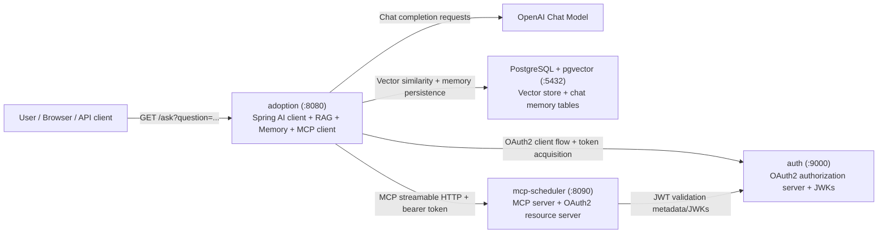
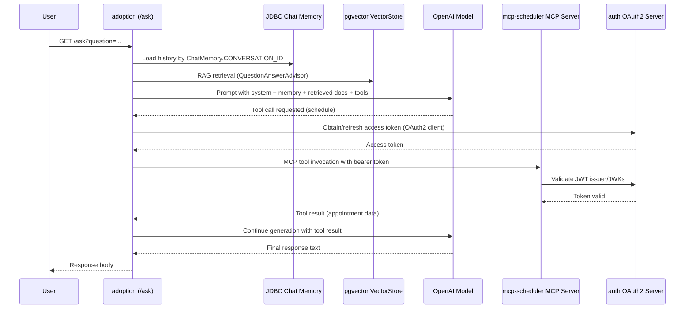
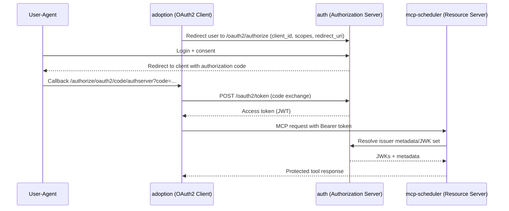
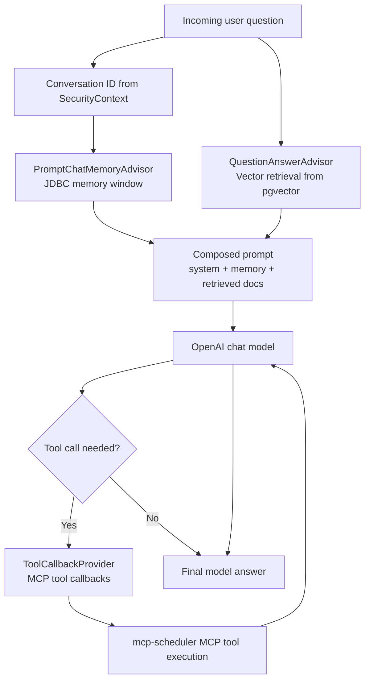

# Spring Boot AI Adoption Example: Deep Dive

This document explains:
- everything implemented across the 3 projects in this repository,
- what was analyzed and documented,
- how OAuth2 works in Spring (with examples),
- how Spring AI is applied here (RAG, memory, MCP tool calling, tool callbacks),
- how MCP and OAuth2 security are connected in this implementation.

---

## 1) Repository map and purpose

This repository contains three Spring Boot applications that work together:

1. `auth`
- OAuth2 Authorization Server.
- Issues tokens and exposes issuer metadata/JWKS.

2. `mcp-scheduler`
- MCP Server.
- Exposes scheduling tool(s) via MCP over streamable transport.
- Secured as OAuth2 Resource Server.

3. `adoption`
- AI chat orchestration application.
- Receives user prompts, performs RAG over pgvector, uses memory, and can call MCP tools.

### 1.1 System architecture diagram



---

## 2) What was done in this analysis/documentation task

I analyzed all implementation files in the three projects:
- `adoption/src/main/java/com/dg/adoption/AdoptionApplication.java`
- `adoption/src/main/resources/application.yaml`
- `adoption/pom.xml`
- `auth/src/main/java/com/dg/auth/AuthApplication.java`
- `auth/src/main/resources/application.yaml`
- `auth/pom.xml`
- `mcp-scheduler/src/main/java/com/dg/mcp_scheduler/McpSchedulerApplication.java`
- `mcp-scheduler/src/main/resources/application.yaml`
- `mcp-scheduler/pom.xml`
- `adoption/compose.yaml`

I then created project-level READMEs:
- `adoption/README.md`
- `auth/README.md`
- `mcp-scheduler/README.md`

I compiled all projects to verify code compiles as documented:
- `adoption`: `./mvnw -q -DskipTests compile`
- `auth`: `./mvnw -q -DskipTests compile`
- `mcp-scheduler`: `./mvnw -q -DskipTests compile`

All three compile commands succeeded.

---

## 3) Complete feature inventory by project

## `adoption` feature inventory

- Spring Boot 4.0.2, Java 25, Spring MVC.
- Endpoint: `GET /ask`.
- Spring AI OpenAI chat model integration.
- Spring AI `ChatClient` orchestration.
- RAG with `QuestionAnswerAdvisor` + pgvector vector store.
- JDBC chat memory via `JdbcChatMemoryRepository`.
- Windowed memory via `MessageWindowChatMemory`.
- Memory prompt injection via `PromptChatMemoryAdvisor`.
- MCP client via `spring-ai-starter-mcp-client`.
- MCP tool invocation via `ToolCallbackProvider`.
- OAuth2 client support (`spring-boot-starter-security-oauth2-client`).
- MCP client OAuth2 request customization:
  - `OAuth2AuthorizationCodeSyncHttpRequestCustomizer`
  - `AuthenticationMcpTransportContextProvider`
- Data JDBC repository (`DogRepository`) and record model (`Dog`).
- Postgres dialect bean for JDBC.
- Actuator, DevTools.
- Docker compose to run local pgvector Postgres.

## `auth` feature inventory

- Spring Boot 4.0.2, Java 25.
- Spring Security OAuth2 Authorization Server starter.
- MCP Authorization Server extension (`mcp-authorization-server`).
- In-memory users (`george`, `josh`).
- Delegating password encoder.
- Configured OAuth2 client registration `default-client`.
- Grant types enabled:
  - `authorization_code`
  - `client_credentials`
- Client authentication methods enabled:
  - `client_secret_basic`
  - `client_secret_post`
  - `none`
- Port `9000`.

## `mcp-scheduler` feature inventory

- Spring Boot 4.0.2, Java 25.
- MCP server starter for Spring MVC (`spring-ai-starter-mcp-server-webmvc`).
- MCP server security (`mcp-server-security`).
- OAuth2 resource server (`spring-boot-starter-security-oauth2-resource-server`).
- JWT issuer validation against `http://localhost:9000`.
- Tool declaration with `@McpTool` and `@McpToolParam`.
- Tool response built from authenticated principal + computed appointment date.
- Port `8090`.

---

## 4) End-to-end runtime architecture in this repo

1. User calls `adoption` `/ask` endpoint.
2. `adoption` builds a Spring AI prompt using:
- system instructions,
- memory advisor,
- RAG advisor,
- tool callbacks.
3. If LLM decides a tool is needed, tool callback invokes MCP client.
4. MCP client communicates with `mcp-scheduler` MCP server over streamable HTTP.
5. OAuth2 tokens and auth context are used for secure MCP calls.
6. `mcp-scheduler` validates JWT using issuer metadata from `auth`.
7. Tool executes and returns structured result.
8. `adoption` receives tool output and finalizes natural-language answer.

### 4.1 End-to-end `/ask` sequence



---

## 5) OAuth2 in Spring: concepts and how this repo applies them

## 5.1 Core OAuth2 roles mapped to this repo

- Authorization Server: `auth`
- Client Application: `adoption`
- Resource Server: `mcp-scheduler`
- Resource Owner/User: demo users `george` and `josh`

## 5.2 How Spring structures OAuth2 components

### OAuth2 Client side (in `adoption`)
- Client registrations are configured in properties under `spring.security.oauth2.client`.
- Spring Security uses `OAuth2AuthorizedClientManager` to obtain/manage access tokens.
- `HttpSecurity.oauth2Client()` enables OAuth2 client support in the security chain.

In this code:
- registration id is `authserver` (`adoption/src/main/resources/application.yaml:20`).
- issuer is `http://localhost:9000` (`adoption/src/main/resources/application.yaml:27`).
- grant type is `authorization_code` (`adoption/src/main/resources/application.yaml:23`).
- OAuth2 client is enabled in security chain (`adoption/src/main/java/com/dg/adoption/AdoptionApplication.java:45`).
- `OAuth2AuthorizedClientManager` is explicitly injected into MCP request customizer (`adoption/src/main/java/com/dg/adoption/AdoptionApplication.java:55`).

### Authorization Server side (in `auth`)
- Spring Authorization Server provides auth/token/metadata/JWK endpoints.
- Registered clients define grant types, auth methods, redirect URIs, token TTL.

In this code:
- `default-client` is declared (`auth/src/main/resources/application.yaml:8`).
- supports auth code and client credentials (`auth/src/main/resources/application.yaml:18`).
- client secret and redirect URIs are configured (`auth/src/main/resources/application.yaml:13`, `auth/src/main/resources/application.yaml:21`).
- MCP authorization-server configurer applied (`auth/src/main/java/com/dg/auth/AuthApplication.java:24`).

### Resource Server side (in `mcp-scheduler`)
- Resource Server validates bearer JWTs.
- `issuer-uri` enables metadata/JWK discovery.

In this code:
- issuer set to `http://localhost:9000` (`mcp-scheduler/src/main/resources/application.yaml:13`).
- MCP OAuth2 resource-server configurer applied (`mcp-scheduler/src/main/java/com/dg/mcp_scheduler/McpSchedulerApplication.java:29`).

## 5.3 Authorization Code flow in this architecture

Practical sequence for this repo:

1. `adoption` needs an access token for registration `authserver`.
2. `OAuth2AuthorizedClientManager` handles token acquisition using auth code rules.
3. User authentication/consent interactions occur at `auth` authorization endpoint.
4. `auth` redirects back to registered redirect URI in `adoption`.
5. `adoption` exchanges code for access token.
6. `adoption` sends token when calling secured MCP server operations.
7. `mcp-scheduler` validates JWT issuer and accepts/rejects request.

Important nuance in this codebase:
- `adoption` currently allows all inbound requests (`permitAll`), so depending on runtime session and request context, principal can be anonymous. For fully user-bound OAuth2 authorization-code behavior, the user must have an authenticated security context during token flow.

### 5.3.1 OAuth2 Authorization Code flow sequence



## 5.4 Spring OAuth2 examples (generic + this repo)

### Example A: OAuth2 Client registration (this repo style)
```yaml
spring:
  security:
    oauth2:
      client:
        registration:
          authserver:
            client-id: default-client
            client-secret: default-secret
            authorization-grant-type: authorization_code
            provider: authserver
        provider:
          authserver:
            issuer-uri: http://localhost:9000
```

### Example B: Resource Server JWT issuer validation (this repo style)
```yaml
spring:
  security:
    oauth2:
      resourceserver:
        jwt:
          issuer-uri: http://localhost:9000
```

### Example C: Authorization Server registered client (this repo style)
```yaml
spring:
  security:
    oauth2:
      authorizationserver:
        client:
          default-client:
            token:
              access-token-time-to-live: 1h
            registration:
              client-id: "default-client"
              client-secret: "{noop}default-secret"
              authorization-grant-types:
                - "authorization_code"
                - "client_credentials"
```

---

## 6) How Spring AI is applied in this repository

## 6.1 Chat orchestration with `ChatClient`

`adoption` builds a `ChatClient` with:
- system prompt,
- OpenAI options,
- default tool callbacks,
- default advisors.

Implementation:
- `defaultSystem(...)` (`adoption/src/main/java/com/dg/adoption/AdoptionApplication.java:121`)
- `defaultOptions(OpenAiChatOptions...)` (`adoption/src/main/java/com/dg/adoption/AdoptionApplication.java:122`)
- `defaultToolCallbacks(toolCallbackProvider)` (`adoption/src/main/java/com/dg/adoption/AdoptionApplication.java:127`)
- `defaultAdvisors(questionAnswerAdvisor, promptChatMemoryAdvisor)` (`adoption/src/main/java/com/dg/adoption/AdoptionApplication.java:128`)

## 6.2 RAG with `QuestionAnswerAdvisor`

RAG behavior in this repo:
- A `VectorStore` bean is autoconfigured by pgvector starter.
- `QuestionAnswerAdvisor` is created with that vector store.
- Advisor participates in every chat call via `defaultAdvisors(...)`.

Implementation:
- bean creation (`adoption/src/main/java/com/dg/adoption/AdoptionApplication.java:66`)
- vector store config (`adoption/src/main/resources/application.yaml:48`)

Practical effect:
- Similar documents are retrieved and added as contextual information for the model before response generation.

Current limitation:
- demo code contains an ingestion block guarded by `if (false)` (`adoption/src/main/java/com/dg/adoption/AdoptionApplication.java:108`), so vector store will be empty unless you enable loading.

## 6.3 Memory with `PromptChatMemoryAdvisor`

Memory chain in this repo:
- JDBC-backed repository (`JdbcChatMemoryRepository`).
- Wrapped by `MessageWindowChatMemory`.
- Applied via `PromptChatMemoryAdvisor`.
- Conversation id set from authenticated principal name.

Implementation:
- memory repo creation (`adoption/src/main/java/com/dg/adoption/AdoptionApplication.java:74`)
- memory advisor creation (`adoption/src/main/java/com/dg/adoption/AdoptionApplication.java:84`)
- conversation id assignment (`adoption/src/main/java/com/dg/adoption/AdoptionApplication.java:139`)
- schema auto-init (`adoption/src/main/resources/application.yaml:45`)

Practical effect:
- responses can consider prior conversation turns for a given conversation id/user.

## 6.4 Tool calling with `ToolCallbackProvider` and MCP

### What `ToolCallbackProvider` does here
- It is injected into `AdoptionsController` constructor.
- It is passed to `.defaultToolCallbacks(...)`.
- This makes tools available to the model for tool/function calling.

Implementation:
- injection point (`adoption/src/main/java/com/dg/adoption/AdoptionApplication.java:100`)
- registration with ChatClient (`adoption/src/main/java/com/dg/adoption/AdoptionApplication.java:127`)

### How MCP provides tools
- MCP client is configured in `adoption` (`spring.ai.mcp.client...`).
- MCP server tool is declared in `mcp-scheduler` with `@McpTool`.
- When connected, tool definitions from MCP server are surfaced to the client side tool-callback layer.

Implementation:
- MCP client connection config (`adoption/src/main/resources/application.yaml:36`)
- MCP tool declaration (`mcp-scheduler/src/main/java/com/dg/mcp_scheduler/McpSchedulerApplication.java:38`)

### How OAuth2 is applied to MCP communication
- `adoption` creates `OAuth2AuthorizationCodeSyncHttpRequestCustomizer` using `OAuth2AuthorizedClientManager` and registration id `authserver`.
- `adoption` sets `AuthenticationMcpTransportContextProvider` in `McpSyncClientCustomizer`.
- `mcp-scheduler` enforces OAuth2/JWT via `mcpServerOAuth2()` and issuer URI.

Implementation:
- request customizer bean (`adoption/src/main/java/com/dg/adoption/AdoptionApplication.java:55`)
- transport context provider (`adoption/src/main/java/com/dg/adoption/AdoptionApplication.java:61`)
- MCP server OAuth2 config (`mcp-scheduler/src/main/java/com/dg/mcp_scheduler/McpSchedulerApplication.java:29`)

### 6.5 Spring AI processing pipeline in this repo



---

## 7) Extra implementation observations

- `adoption` uses `permitAll()` for inbound endpoints, which is fine for demo but not production-safe.
- `auth` currently stores users/clients in-memory or static config.
- `mcp-scheduler` tool result is not persisted.
- all modules target Java 25 and include GraalVM native plugin.

---

## 8) Official documentation references

These references were selected to match the exact technologies used in this repository.

## OAuth2 / Spring Security / Authorization Server

- Spring Security OAuth2 client reference:
  - [https://docs.spring.io/spring-security/reference/servlet/oauth2/client/index.html](https://docs.spring.io/spring-security/reference/servlet/oauth2/client/index.html)
- Spring Security OAuth2 client core concepts:
  - [https://docs.spring.io/spring-security/reference/servlet/oauth2/client/core.html](https://docs.spring.io/spring-security/reference/servlet/oauth2/client/core.html)
- Spring Security OAuth2 authorized clients:
  - [https://docs.spring.io/spring-security/reference/servlet/oauth2/client/authorized-clients.html](https://docs.spring.io/spring-security/reference/servlet/oauth2/client/authorized-clients.html)
- Spring Security OAuth2 resource server JWT:
  - [https://docs.spring.io/spring-security/reference/servlet/oauth2/resource-server/jwt.html](https://docs.spring.io/spring-security/reference/servlet/oauth2/resource-server/jwt.html)
- Spring Authorization Server reference index:
  - [https://docs.spring.io/spring-authorization-server/reference/index.html](https://docs.spring.io/spring-authorization-server/reference/index.html)
- Spring Authorization Server protocol endpoints:
  - [https://docs.spring.io/spring-authorization-server/reference/protocol-endpoints.html](https://docs.spring.io/spring-authorization-server/reference/protocol-endpoints.html)
- Spring Boot OAuth2 property classes (client/resource-server):
  - [https://docs.spring.io/spring-boot/api/java/org/springframework/boot/autoconfigure/security/oauth2/client/OAuth2ClientProperties.html](https://docs.spring.io/spring-boot/api/java/org/springframework/boot/autoconfigure/security/oauth2/client/OAuth2ClientProperties.html)
  - [https://docs.spring.io/spring-boot/api/java/org/springframework/boot/autoconfigure/security/oauth2/resource/servlet/OAuth2ResourceServerProperties.html](https://docs.spring.io/spring-boot/api/java/org/springframework/boot/autoconfigure/security/oauth2/resource/servlet/OAuth2ResourceServerProperties.html)

## Spring AI

- Spring AI ChatClient API:
  - [https://docs.spring.io/spring-ai/reference/api/chatclient.html](https://docs.spring.io/spring-ai/reference/api/chatclient.html)
- Spring AI Advisors API:
  - [https://docs.spring.io/spring-ai/reference/api/advisors.html](https://docs.spring.io/spring-ai/reference/api/advisors.html)
- Spring AI Retrieval Augmented Generation:
  - [https://docs.spring.io/spring-ai/reference/api/retrieval-augmented-generation.html](https://docs.spring.io/spring-ai/reference/api/retrieval-augmented-generation.html)
- Spring AI Chat Memory:
  - [https://docs.spring.io/spring-ai/reference/api/chat-memory.html](https://docs.spring.io/spring-ai/reference/api/chat-memory.html)
- Spring AI Tool Calling:
  - [https://docs.spring.io/spring-ai/reference/api/tools.html](https://docs.spring.io/spring-ai/reference/api/tools.html)
- Spring AI MCP client starter docs:
  - [https://docs.spring.io/spring-ai/reference/api/mcp/mcp-client-boot-starter-docs.html](https://docs.spring.io/spring-ai/reference/api/mcp/mcp-client-boot-starter-docs.html)
- Spring AI MCP server starter docs:
  - [https://docs.spring.io/spring-ai/reference/api/mcp/mcp-server-boot-starter-docs.html](https://docs.spring.io/spring-ai/reference/api/mcp/mcp-server-boot-starter-docs.html)
- Spring AI MCP annotations docs:
  - [https://docs.spring.io/spring-ai/reference/api/mcp/mcp-annotations.html](https://docs.spring.io/spring-ai/reference/api/mcp/mcp-annotations.html)
- Spring AI MCP security docs:
  - [https://docs.spring.io/spring-ai/reference/api/mcp/mcp-security.html](https://docs.spring.io/spring-ai/reference/api/mcp/mcp-security.html)
- Spring AI pgvector vector store:
  - [https://docs.spring.io/spring-ai/reference/api/vectordbs/pgvector.html](https://docs.spring.io/spring-ai/reference/api/vectordbs/pgvector.html)

## MCP specification

- Model Context Protocol specification:
  - [https://modelcontextprotocol.io/specification/2025-06-18](https://modelcontextprotocol.io/specification/2025-06-18)

---

## 9) Suggested next learning steps for this repo

1. Enable vector ingestion by replacing `if (false)` with a bootstrap routine and add seed dog data.
2. Protect `/ask` with authenticated sessions to make user-bound OAuth2 and memory behavior explicit.
3. Add integration tests for:
- authorization-code login flow,
- MCP tool invocation with/without valid JWT,
- RAG retrieval behavior with populated vectors.

**Note: This repo has been inspired from Josh Long video**
